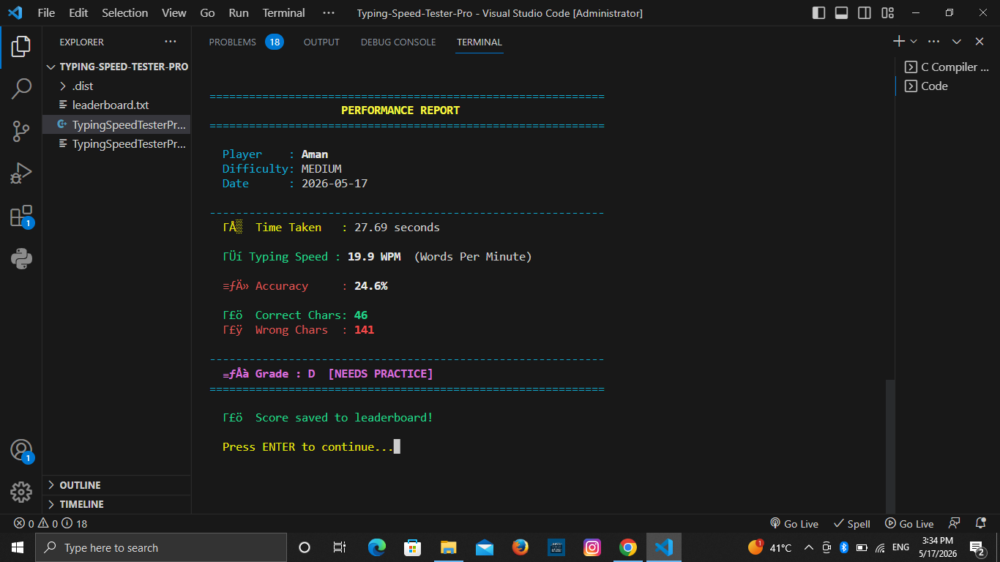

# ⌨️ Typing Speed Tester Pro

A modern console-based Typing Speed Tester application developed using C++.  
This project measures typing speed, typing accuracy, and performance using a timer-based system.

---

## 🚀 Features

- 🕒 Real-time Typing Timer
- ⚡ WPM (Words Per Minute) Calculation
- 🎯 Accuracy Percentage Calculation
- 📊 Performance Report
- 🏆 Leaderboard System using File Handling
- 🎚️ Difficulty Levels (Easy, Medium, Hard)
- 🔀 Random Paragraph Generation
- 🎨 Colored Console Interface
- 📁 Single File C++ Project

---

## 🛠️ Technologies Used

- C++
- STL (Vectors, Strings)
- File Handling
- Chrono Library
- Functions & Structures
- Console-Based UI

---

## 📌 How WPM is Calculated
## 📸 Screenshots

### Main Menu

### Leaderboard

text
WPM = (Total Characters Typed / 5) / Time in Minutes

## How Accuracy is Calculated
Accuracy = (Correct Characters / Total Characters) × 100

